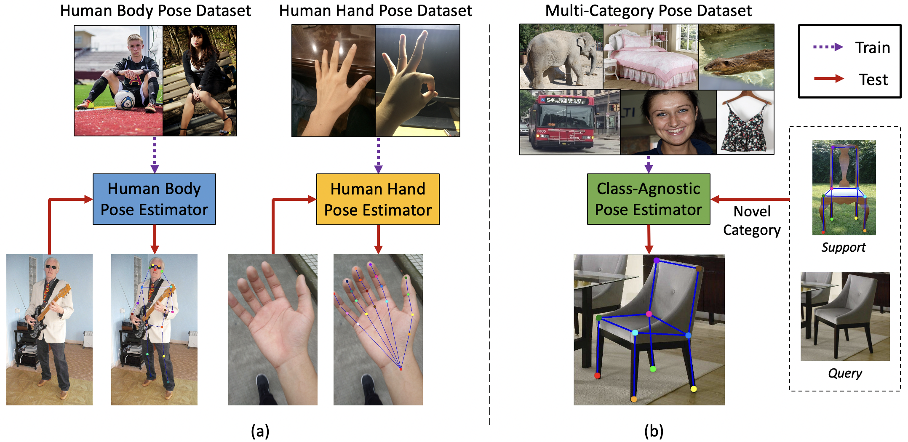
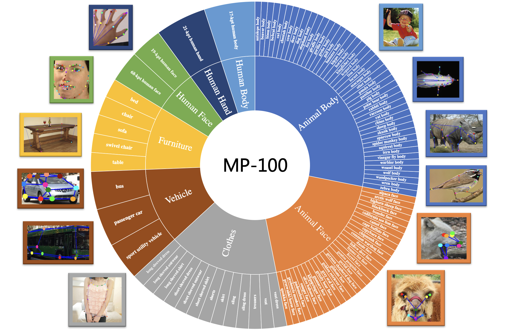

# Pose-for-Everything (ECCV'2022 Oral)

## Introduction

Official code repository for the paper:  
[**Pose for Everything: Towards Category-Agnostic Pose Estimation**](https://arxiv.org/pdf/2207.10387.pdf)    
[Lumin Xu*, Sheng Jin*, Wang Zeng, Wentao Liu, Chen Qian, Wanli Ouyang, Ping Luo, and Xiaogang Wang]  

### Abstract
Existing works on 2D pose estimation mainly focus on a certain category, e.g. human, animal, and vehicle. However, there are lots of application scenarios that require detecting the poses/keypoints of the unseen class of objects. In this paper, we introduce the task of CategoryAgnostic Pose Estimation (CAPE), which aims to create a pose estimation model capable of detecting the pose of any class of object given only a few samples with keypoint definition. To achieve this goal, we formulate the pose estimation problem as a keypoint matching problem and design a novel CAPE framework, termed POse Matching Network (POMNet). A transformer-based Keypoint Interaction Module (KIM) is proposed to capture both the interactions among different keypoints and the relationship between the support and query images. We also introduce Multi-category Pose (MP-100) dataset, which is a 2D pose dataset of 100 object categories containing over 20K instances and is well-designed for developing CAPE algorithms. Experiments show that our method outperforms other baseline approaches by a large margin. Codes and data are available at https://github.com/luminxu/Pose-for-Everything. 



## Usage

### Install

1. Install [mmpose](https://github.com/open-mmlab/mmpose).
2. run `python setup.py develop`.

### Training
You can follow the guideline of [mmpose](https://github.com/open-mmlab/mmpose/blob/master/docs/en/get_started.md).

#### Train with multiple GPUs
```shell
./tools/dist_train.sh ${CONFIG_FILE} ${GPU_NUM} [optional arguments]
```

#### Train with multiple machines

If you can run this code on a cluster managed with [slurm](https://slurm.schedmd.com/), you can use the script `slurm_train.sh`. (This script also supports single machine training.)

```shell
./tools/slurm_train.sh ${PARTITION} ${JOB_NAME} ${CONFIG_FILE} ${WORK_DIR}
```

Here is an example of using 16 GPUs to train POMNet on the dev partition in a slurm cluster.
(Use `GPUS_PER_NODE=8` to specify a single slurm cluster node with 8 GPUs, `CPUS_PER_TASK=2` to use 2 cpus per task.
Assume that `Test` is a valid ${PARTITION} name.)

```shell
GPUS=16 GPUS_PER_NODE=8 CPUS_PER_TASK=2 ./tools/slurm_train.sh Test pomnet \
  configs/mp100/pomnet/pomnet_mp100_split1_256x256_1shot.py \
  work_dirs/pomnet_mp100_split1_256x256_1shot
```


## MP-100 Dataset



### Terms of Use
1. The dataset is only for non-commercial research purposes. 
2. All images of the MP-100 dataset are from existing datasets ([COCO](http://cocodataset.org/), 
[300W](https://ibug.doc.ic.ac.uk/resources/300-W/), 
[AFLW](https://www.tugraz.at/institute/icg/research/team-bischof/learning-recognition-surveillance/downloads/aflw), 
[OneHand10K](https://www.yangangwang.com/papers/WANG-MCC-2018-10.html), 
[DeepFashion](http://mmlab.ie.cuhk.edu.hk/projects/DeepFashion/LandmarkDetection.html), 
[AP-10K](https://github.com/AlexTheBad/AP-10K), 
[MacaquePose](http://www.pri.kyoto-u.ac.jp/datasets/macaquepose/index.html), 
[Vinegar Fly](https://github.com/jgraving/DeepPoseKit-Data), 
[Desert Locust](https://github.com/jgraving/DeepPoseKit-Data), 
[CUB-200](http://www.vision.caltech.edu/datasets/cub_200_2011/), 
[CarFusion](http://www.cs.cmu.edu/~ILIM/projects/IM/CarFusion/cvpr2018/index.html), 
[AnimalWeb](https://fdmaproject.wordpress.com/author/fdmaproject/), 
[Keypoint-5](https://github.com/jiajunwu/3dinn)), which are not our property. We are not responsible for the content nor the meaning of these images. 
3. We provide the [annotations](https://drive.google.com/drive/folders/1pzC5uEgi4AW9RO9_T1J-0xSKF12mdj1_?usp=sharing) for training and testing. However, for legal reasons, we do not host the images. Please follow the [guidance](mp100/README.md) to prepare MP-100 dataset.


## Citation
```bibtex
@article{xu2022pose,
  title={Pose for Everything: Towards Category-Agnostic Pose Estimation},
  author={Xu, Lumin and Jin, Sheng and Zeng, Wang and Liu, Wentao and Qian, Chen and Ouyang, Wanli and Luo, Ping and Wang, Xiaogang},
  booktitle={European Conference on Computer Vision (ECCV)},
  year={2022},
  month={October}
}
```

## Acknowledgement

Thanks to:

- [MMPose](https://github.com/open-mmlab/mmpose)

## License

This project is released under the [Apache 2.0 license](LICENSE).
